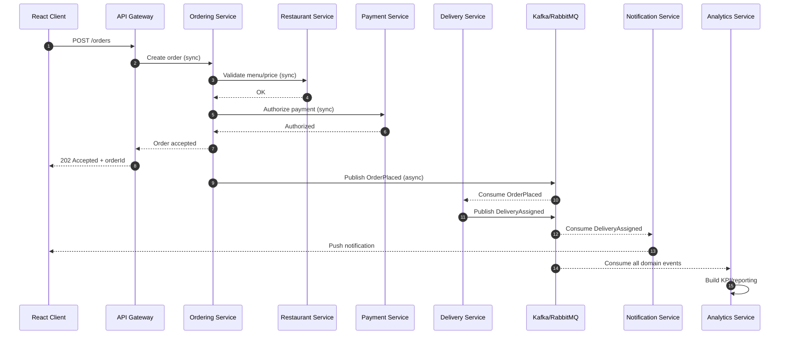

# Communication Diagram - Sync vs Async

```mermaid
sequenceDiagram
    autonumber
    participant Client as React Client
    participant Gateway as API Gateway
    participant Ordering as Ordering Service
    participant Restaurant as Restaurant Service
    participant Payment as Payment Service
    participant Delivery as Delivery Service
    participant Bus as Kafka/RabbitMQ
    participant Noti as Notification Service
    participant Analytics as Analytics Service

    Client->>Gateway: POST /orders
    Gateway->>Ordering: Create order (sync)
    Ordering->>Restaurant: Validate menu/price (sync)
    Restaurant-->>Ordering: OK
    Ordering->>Payment: Authorize payment (sync)
    Payment-->>Ordering: Authorized
    Ordering-->>Gateway: Order accepted
    Gateway-->>Client: 202 Accepted + orderId

    Ordering->>Bus: Publish OrderPlaced (async)
    Bus-->>Delivery: Consume OrderPlaced
    Delivery->>Bus: Publish DeliveryAssigned

    Bus-->>Noti: Consume DeliveryAssigned
    Noti-->>Client: Push notification

    Bus-->>Analytics: Consume all domain events
    Analytics->>Analytics: Build KPI/reporting
```
