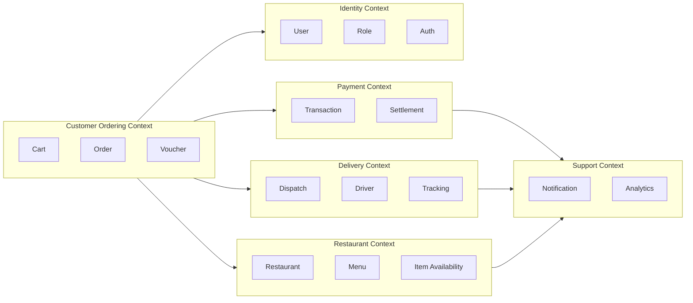

# Context Map - Bounded Context

```mermaid
graph LR
    subgraph CustomerDomain[Customer Ordering Context]
        C1[Cart]
        C2[Order]
        C3[Voucher]
    end

    subgraph RestaurantDomain[Restaurant Context]
        R1[Restaurant]
        R2[Menu]
        R3[Item Availability]
    end

    subgraph PaymentDomain[Payment Context]
        P1[Transaction]
        P2[Settlement]
    end

    subgraph DeliveryDomain[Delivery Context]
        D1[Dispatch]
        D2[Driver]
        D3[Tracking]
    end

    subgraph IdentityDomain[Identity Context]
        I1[User]
        I2[Role]
        I3[Auth]
    end

    subgraph SupportDomain[Support Context]
        N1[Notification]
        A1[Analytics]
    end

    CustomerDomain --> RestaurantDomain
    CustomerDomain --> PaymentDomain
    CustomerDomain --> DeliveryDomain
    CustomerDomain --> IdentityDomain

    PaymentDomain --> SupportDomain
    DeliveryDomain --> SupportDomain
    RestaurantDomain --> SupportDomain
```
