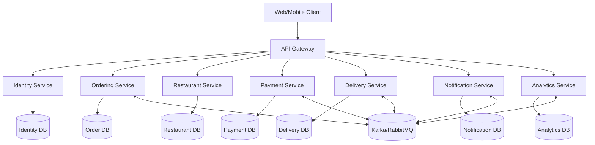

# Service Map - Online Food Delivery

```mermaid
graph TD
    UI[Web/Mobile Client]
    GW[API Gateway]

    UI --> GW

    GW --> ID[Identity Service]
    GW --> OR[Ordering Service]
    GW --> RS[Restaurant Service]
    GW --> PM[Payment Service]
    GW --> DL[Delivery Service]
    GW --> NT[Notification Service]
    GW --> AN[Analytics Service]

    OR --> ODB[(Order DB)]
    ID --> IDB[(Identity DB)]
    RS --> RDB[(Restaurant DB)]
    PM --> PDB[(Payment DB)]
    DL --> DDB[(Delivery DB)]
    NT --> NDB[(Notification DB)]
    AN --> ADB[(Analytics DB)]

    BUS[(Kafka/RabbitMQ)]
    OR <--> BUS
    PM <--> BUS
    DL <--> BUS
    NT <--> BUS
    AN <--> BUS
```
